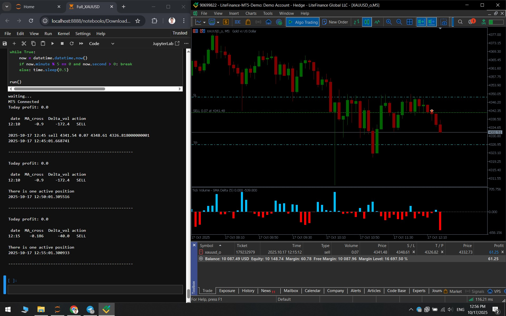
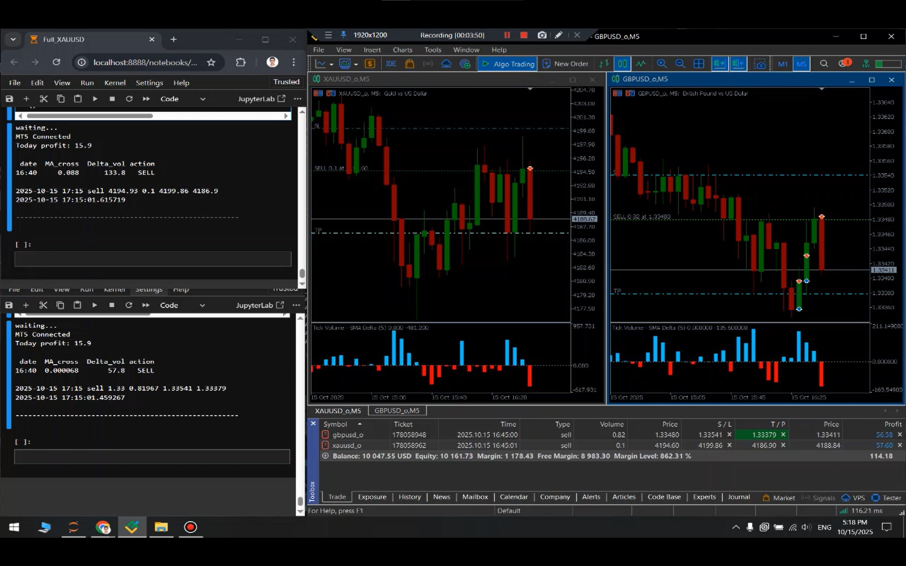
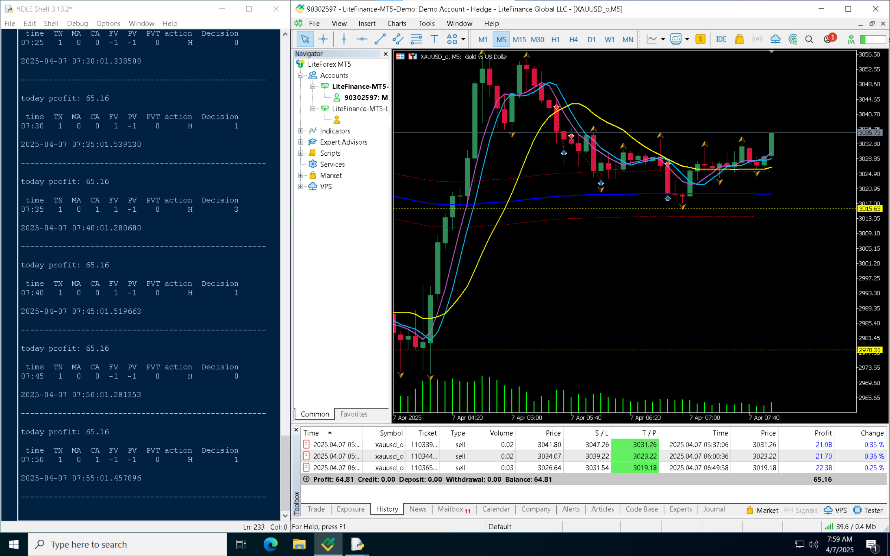
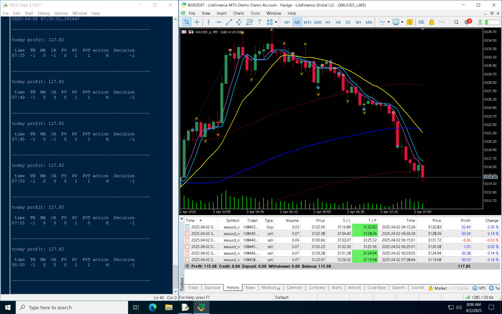
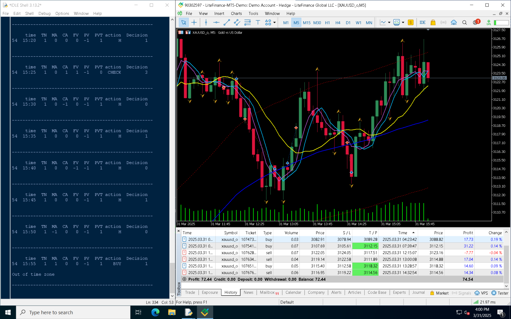
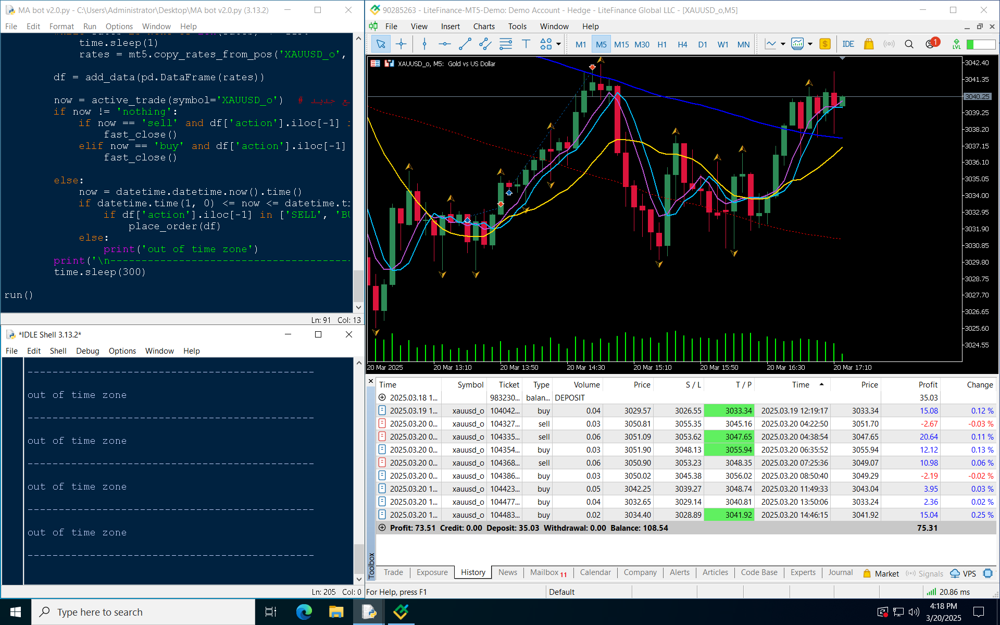

  
  

    <ul>
      
* Quantistan’s proprietary trading algorithm

      
* Powered by genetic algorithms & machine learning 

      
* Fully automated trade execution

    </ul>
  

**Count Heshmat** is the proprietary algorithmic trading engine of the Quantistan, designed to operate as a fully autonomous trading system in financial markets. The project was initiated from Mahdi Masoumian's M.Sc. thesis and continues to be one of Quantistan’s core R&D initiatives.

The system's core relies on machine learning models for price prediction, with outputs filtered through genetically optimized trading rules to generate final signals. All decision‑making and trade execution are performed entirely automatically.

The naming convention is a light‑hearted fictional characterization and bears no relation to any real or historical person.

---

## Key Features

* Price forecasting using machine learning models
* Signal filtering via genetically optimized trading rules
* Fully automated trade execution
* Active trade management and position monitoring
* Designed for continuous improvement in live market conditions

---

## Current Project Status

Count Heshmat is currently under active development and operational evaluation. While early results from demo testing have been highly promising, a sufficient long‑term track record on a real account is not yet available for definitive performance assessment.

Consequently, the system remains under continuous monitoring, analysis, and refinement until a statistically reliable performance history is achieved, enabling operational deployment at scale.

---

## Development Roadmap

Upon completion of the evaluation phase and accumulation of adequate live trading history, the development roadmap includes:

* Operational deployment on real accounts
* Public dissemination of trading signals
* Copy Trading services
* Capital management infrastructure and investor onboarding
* Development of next‑generation algorithms based on live results

---

## Performance Documentation

Below are sample outputs from Count Heshmat’s demo testing. The screenshots include the algorithm execution environment, open trades, closed trades, and recorded results over various periods. They are published solely as technical documentation of the development process.

