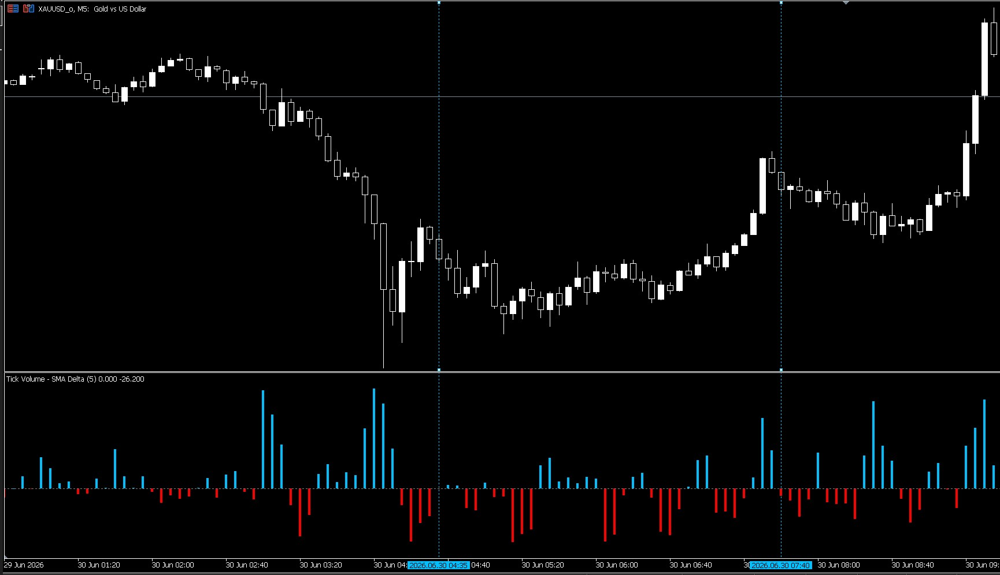

 

### [دانلود اندیکاتور دلتای حجم تیک (گیت‌هاب)](https://github.com/MahdiMasoumian/TickVolDelta_Indicator)

اندیکاتور دلتای حجم تیک تفاوت بین حجم تیک فعلی و میانگین متحرک ساده آن را محاسبه کرده و نتیجه را به‌صورت مقدار مثبت یا منفی نمایش می‌دهد.

زمانی که حجم فعلی بالاتر از میانگین متحرک خود باشد، مقدار مثبت تولید می‌شود؛ وقتی پایین‌تر باشد، مقدار منفی ایجاد می‌شود. از این تفاوت می‌توان برای شناسایی افزایش یا کاهش غیرعادی در فعالیت بازار و مهم‌تر از آن، شناسایی تغییرات احتمالی روند ناشی از تغییرات نسبی حجم نسبت به سطح مبنا استفاده کرد.

