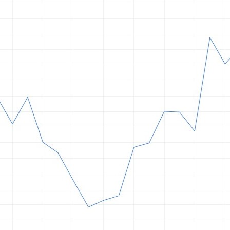
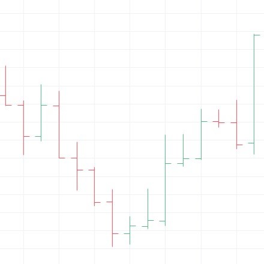
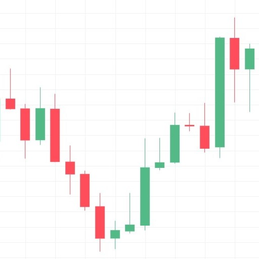
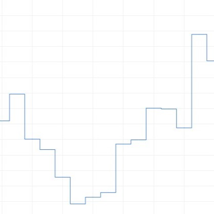
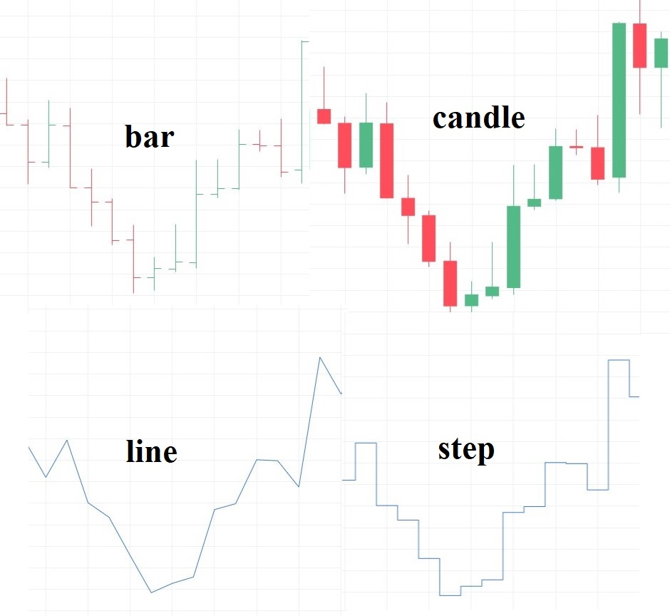

### Why Price Charts Matter

A **price chart** is simply a visual representation of how an asset's price has moved over time. Every price chart, regardless of style, is built from the same underlying data: the price at the start of a period (open), the highest price reached (high), the lowest price reached (low), and the price at the end of the period (close) — commonly abbreviated as OHLC.

What differs between chart types is not the underlying data, but **how much of that data is visually displayed**, and how easy it is to read at a glance.

---

### Timeframe: What Actually Defines a "Period"

Before looking at chart types, it's worth understanding what defines each individual candle, bar, or point on a chart in the first place: the **timeframe**.

A timeframe is simply the length of time that each single OHLC data point represents — for example, one minute (M1), one hour (H1), or one day (D1). On an H1 chart, every candle summarizes an entire hour of trading into a single open, high, low, and close. On an M1 chart, that same hour would be broken into 60 separate candles, one per minute.

This means the exact same price history can look completely different depending on the timeframe chosen: a short-term spike that's clearly visible as its own candle on an M1 chart might be barely noticeable, absorbed into the wick of a single candle, on a D1 chart. Timeframe doesn't change the underlying price data — it changes how that data is grouped and summarized before being drawn.

---

### Line Chart

A **line chart** is the simplest form of price chart. It connects only the closing prices of each period with a continuous line, ignoring the open, high, and low entirely.

Line charts are useful for getting a quick, uncluttered view of the overall trend, but they hide a lot of information — you have no idea how much the price fluctuated within each period, only where it ended up.

---

### Bar Chart

A **bar chart** (sometimes called an OHLC bar chart) shows all four price points for each period using a single vertical bar. A small tick on the left side of the bar marks the open price, and a small tick on the right side marks the close price. The top and bottom of the bar represent the high and low.

This gives a trader the complete OHLC picture, but bar charts are visually less intuitive than candlesticks — the direction of the period isn't immediately obvious without looking closely at the tick positions.

---

### Candlestick Chart

A **candlestick chart** displays the same OHLC data as a bar chart, but in a format that's easier to read visually. Each candle has a "body" representing the range between the open and close, and "wicks" (or shadows) above and below the body representing the high and low.

The body is typically color-coded — one color if the close was higher than the open, another if it was lower — making the direction of each period immediately visible at a glance.

---

### Step Chart

A **step chart** is a less common variation that plots price as a series of horizontal and vertical steps, changing level only when the price actually changes, rather than smoothly connecting points like a line chart.

Step charts are used far less frequently in trading than the other three types, but they can be useful for visualizing discrete price changes without the smoothing effect a line chart introduces.

---

### All Chart Types Compared Side by Side

Placed next to each other, the difference in information density becomes clear: the line and step charts show only the closing price trend, while the bar and candlestick charts reveal the full range of price movement within each period.

---

### Does Chart Type Actually Matter?

Here's an important distinction to understand as you move toward algorithmic trading: **chart appearance mostly matters when a trade is executed manually or when a trader is actively watching the chart to make decisions.**

An algorithm doesn't "look" at a chart the way a human does. It simply reads four numeric values — open, high, low, and close — for each period, directly from the data, at whatever timeframe the strategy is designed for. Whether that data happens to be displayed as candlesticks, bars, a line, or a step chart on someone's screen makes absolutely no difference to how the algorithm processes it. The visual style is a human convenience, not something the trading logic depends on — the timeframe, on the other hand, is something the algorithm absolutely depends on, since it determines exactly which OHLC values it receives.

That said, **candlestick charts are the most commonly used format**, for a simple reason: they convey more information than a line chart, while remaining easier to read at a glance than a bar chart. A trader glancing at a candlestick chart immediately sees the direction, the range, and the relative size of the move for each period — all four OHLC values are visible in one compact, intuitively color-coded shape.

---

### Conclusion

Every price chart type is built from the same four underlying values — open, high, low, and close — grouped according to a chosen timeframe, but they differ in how much of that information is visible and how easily it can be read. Line and step charts simplify the view by showing only closing prices, while bar and candlestick charts reveal the full price range of each period, with candlesticks being the most widely used due to their clarity. For algorithmic trading, the visual style makes no difference, but the timeframe absolutely does, since it defines the raw OHLC data the algorithm actually reads.

### One-Sentence

Price charts differ only in how much of the open-high-low-close data they visually display within each timeframe-defined period, with candlestick charts being the most popular for their clarity, while an algorithm depends on the timeframe but not the visual style.